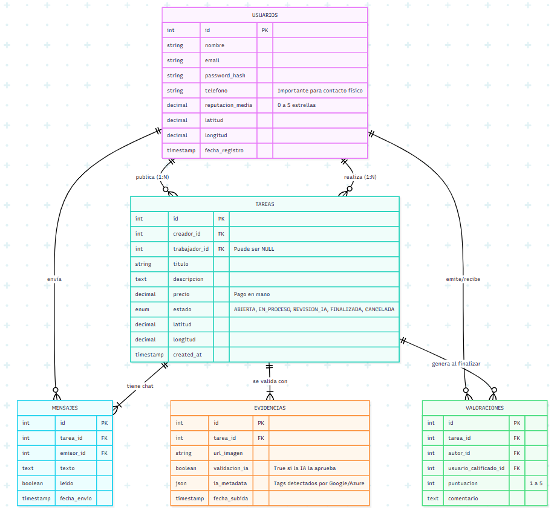
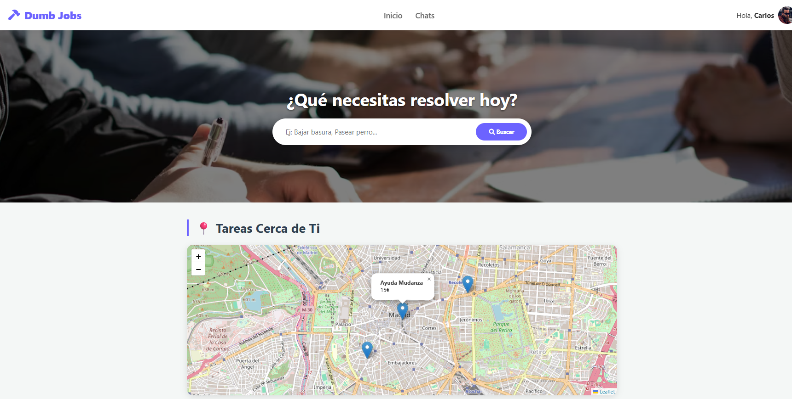
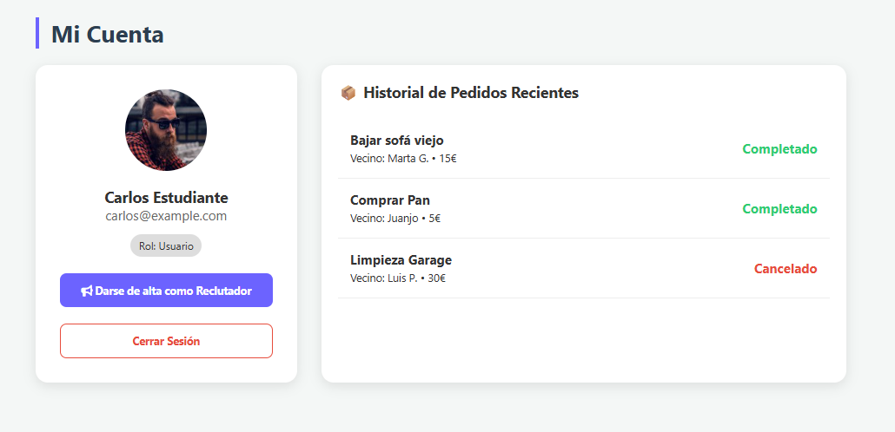
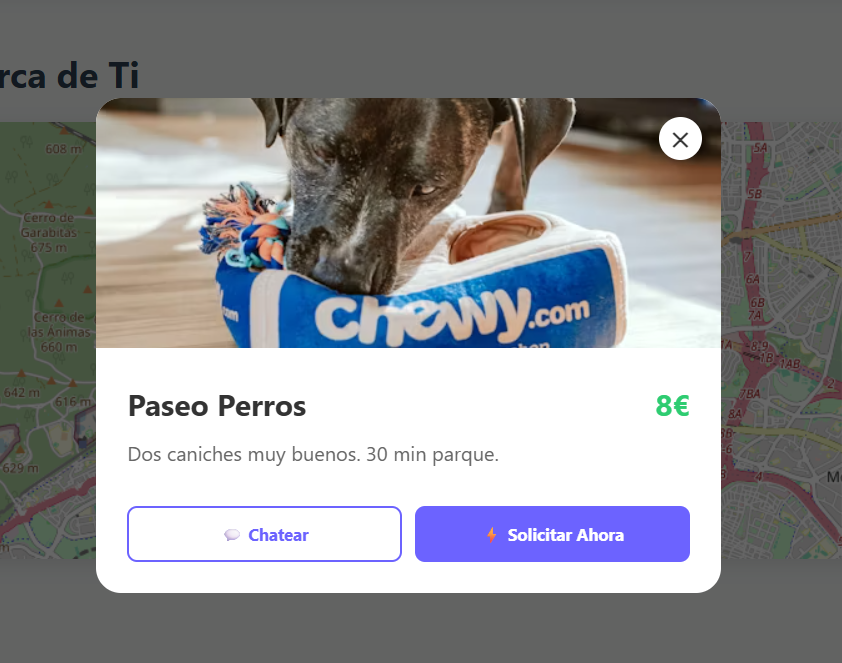
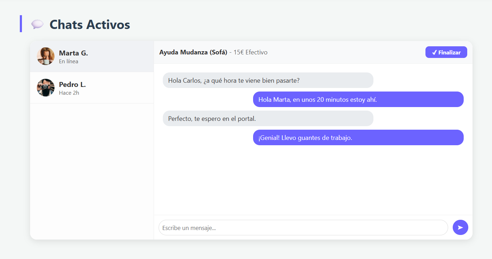
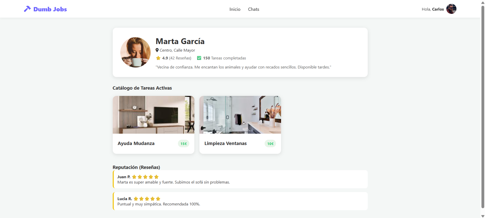

# Dumb Jobs

## Fase 1 - Prototip i creació inicial de la base de dades

## Tabla: `users`

Contiene la información de perfil, acceso y reputación de todos los participantes (tanto creadores de tareas como trabajadores).

**Campos principales:**
- Nombre completo
- Email
- Contraseña (almacenada como **hash**)
- Teléfono
- Reputación media
  > Valor decimal (0-5 estrellas) calculado automáticamente tras cada valoración recibida.
- Latitud
- Longitud
- Fecha de registro (`created_at`)

---

## Tabla: `tasks`

El núcleo del sistema. Gestiona el ciclo de vida del servicio, desde que se solicita hasta que se paga en mano.

**Campos principales:**
- Creador 
- Trabajador
  > Inicialmente es `null` hasta que alguien acepta la tarea.
- Título
- Descripción
- Precio
  > Dato informativo. Indica la cantidad de efectivo que se entregará al finalizar.
- Estado de la tarea
- Latitud
- Longitud
- Fecha de creación

### Estados de la tarea

- **Open** La tarea es visible en el mapa y nadie la ha reclamado aún.
- **In_Process** Un trabajador ha aceptado la tarea y se está dirigiendo al lugar o realizándola.
- **AI_Review** El trabajador ha subido la foto de prueba y la Inteligencia Artificial la está analizando.
- **Completed** La IA ha validado la prueba y el pago en mano se ha realizado.
- **Cancelled** La tarea ha sido eliminada por el creador antes de finalizarse.

---

## Tabla: `evidences`

Módulo de seguridad. Almacena las fotos que demuestran que el trabajo se ha hecho correctamente.

**Campos principales:**
- Tarea (relación con `tasks`)
- URL de la imagen
- Validación IA
  > Booleano. `True` si la API (Google Vision/Azure) detecta que la foto coincide con lo esperado.
- Metadatos IA
  > JSON con la respuesta técnica de la IA (etiquetas detectadas, porcentaje de confianza, etc.).
- Fecha de subida

---

## Tabla: `messages`

Sistema de chat interno para que los usuarios coordinen los detalles antes de encontrarse.

**Campos principales:**
- Tarea (relación con `tasks`)
  > El chat funciona como una "sala" vinculada a una tarea específica.
- Emisor (relación con `users`)
- Contenido del mensaje
- Leído
  > Booleano para indicar si el receptor ha visto el mensaje.
- Fecha de envío

---

## Tabla: `reviews`

Sistema de confianza que permite puntuar a los usuarios al cerrar el trato.

**Campos principales:**
- Tarea (relación con `tasks`)
- Autor (relación con `users`)
  > Quién escribe la reseña.
- Usuario calificado (relación con `users`)
  > Quién recibe la nota (afecta a su reputación media).
- Puntuación
  > Valor entero del 1 al 5.
- Comentario
  > Texto explicativo sobre cómo fue la experiencia.

# Diseño de Interfaz y Flujo de Usuario

### Página de Inicio (Home)
La puerta de entrada a la comunidad. Diseñada para conectar necesidades con soluciones de forma rápida y visual.

  

* **Header**: Logo de Dumb Jobs, menú de navegación simplificado ("Inicio", "Chats") y avatar de perfil.
* **Hero Section**: Imagen de fondo inspiradora con un **buscador central destacado** (*"¿Qué necesitas resolver hoy?"*).
* **Sección "Cerca de ti"**: Mapa interactivo con geolocalización que muestra pines con las tareas disponibles en el vecindario.
* **Tareas destacadas**: Acceso rápido a las tareas más solicitadas o urgentes.

### Panel de Usuario
Gestión de la cuenta personal del usuario logueado.

  

* Muestra perfil (foto, nombre, email, rol actual).
* Opción destacada para **"Darse de alta como Reclutador"** (cambio de rol para publicar tareas).
* Historial de trabajos recientes y botón de cierre de sesión.

### Detalle de Tarea (Modal)
Ventana modal o vista rápida que permite ver la información del trabajo sin abandonar la navegación del mapa.

* **Diseño simple y accesible**: Muestra título, precio en mano, distancia y descripción.
* **Opciones**: Botones grandes para "Solicitar Trabajo" inmediatamente o "Chatear" con el vecino.

### Interfaz de Chat y Acuerdo
Centro de comunicación y gestión del servicio.

  

* Combina la mensajería directa con un **resumen del acuerdo** en la parte superior (Precio y Tarea).
* Permite coordinar la hora del encuentro, confirmar el pago en efectivo y resolver dudas antes de desplazarse.

### Perfil del Vecino (Público)
Vista pública para generar confianza antes de aceptar o solicitar una tarea.

* **Info**: Foto real, nombre, zona de residencia y **valoración media**.
* **Catálogo**: Listado de tareas que tiene activas actualmente.
* **Reputación**: Reseñas detalladas de otros vecinos para validar la seguridad.